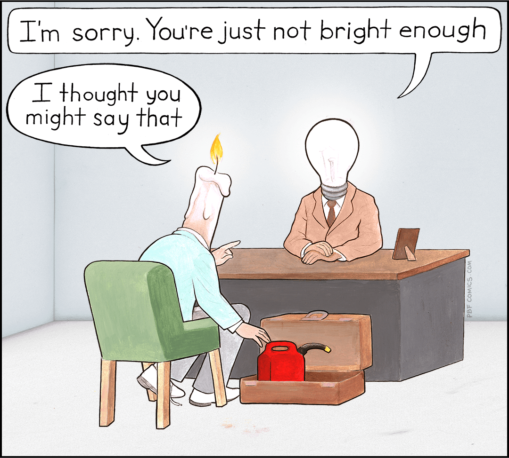

# TELOS about Jeff

> Inspired by [Daniel Miessler](https://github.com/danielmiessler/Telos) and
> [Network Chuck](https://github.com/theNetworkChuck/telos).

## ✅ Problems

- **P1:** Unemployment in software development for older, undereducated individuals
- **P2:** Lack of awareness and control over digital footprint and privacy
- **P3:** The dangerous blend of "dumb", "confident", and "proud" in human behavior

## 🎯 Missions

- **M1 (->P1):** Empower the next generation with valuable knowledge to prevent unemployment and foster economic
  independence.
- **M2 (->P2):** Model and advocate for conscious digital exposure to protect personal freedom in a hyperconnected
  world.
- **M3 (->P3):** Mentor self-awareness and humility through interdisciplinary practices like jiu-jitsu to counter
  ego-driven behavior.

## 🎙️ Narratives

- **Short (15 words):** "Empowering minds, guarding freedom, and mentoring humility for a more conscious generation."
- **Conversational (1 sentence):** "I'm working to prepare the next generation for real freedom-mental, digital, and
  emotional-starting with what I live and teach."
- **30-sec Pitch:** "I've faced barriers in tech, I question how our data is silently harvested, and I see how pride
  distorts human behavior. That's why I'm committed to spreading meaningful knowledge, protecting digital freedom by
  example, and mentoring self-awareness and humility through practices like jiu-jitsu. It's just one life-but I want it
  to echo where it matters."

## 🥅 Goals + Metrics

- **G1 (->M1):** Complete a full-stack web development portfolio by December 2025 and publish it online. - _Metric:_
  Portfolio fully built and accessible.
- **G2 (->M2):** Complete a privacy audit of all personal devices quarterly and document the findings and
  improvements. - _Metric:_ Four audits completed and documented by December 2025.
- **G3 (->M3):** Develop a personal curriculum linking jiu-jitsu principles with emotional intelligence by
  October 2025. - _Metric:_ Curriculum drafted and ready to share.

## 🚧 Challenges

- **C1:** Motivation dips
- **C2:** Limited time
- **C3:** Lack of resources

## 🔧 Strategies

- **S1 (->C1):** Maintain energy and focus by waking early, exercising, drinking coffee, and staying mentally aware.
- **S2 (->C2):** Apply the mindset "non ducor, duco" - lead your time instead of being led by it.
- **S3 (->C3):** Maximize what you have-squeeze the juice out of every orange before seeking more.

## 📂 Projects

- **PJT1 (->G1/S2):** Build and publish a full-stack web development portfolio by December 2025.
- **PJT2 (->G2/S1):** Maintain and follow a quarterly digital hygiene checklist for device audits.
- **PJT3 (->G3/S3):** Draft a personal curriculum connecting jiu-jitsu principles to emotional intelligence by
  October 2025.

## 🕰️ History

- **2006:** First job as office-boy in the autoparts industry
- **2011:** Graduated with a bachelor's degree in Business Management
- **2015:** Spent one year living alone in the USA

## 📒 Log

- _Add dated bullet entries here going forward..._

## 📫 Connect

## Latest PBF Cartoon

